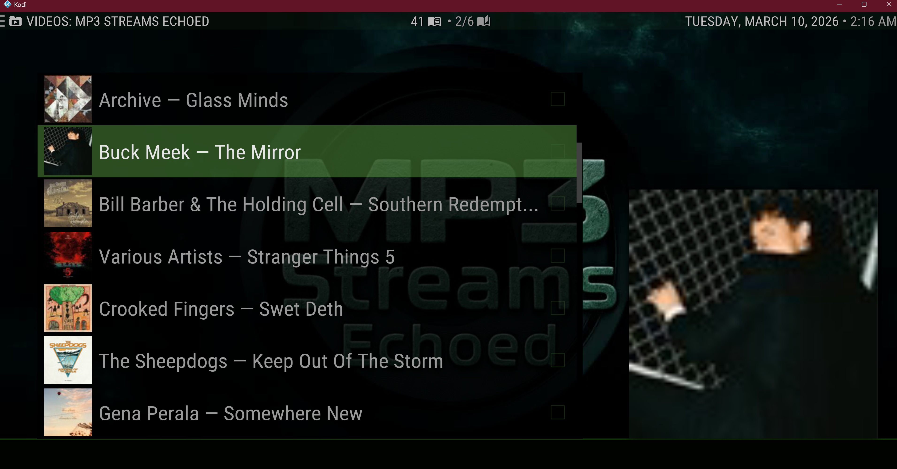

  

  

  

  
  
  
  

  <strong>A modern, fully Python-3-native rebuild of the classic MP3 Streams Reloaded.</strong> 
  Browse and stream music — rebuilt from scratch for Kodi 19+.

---

## What Is This

MP3 Streams Echoed started as a compatibility fix for MP3 Streams Reloaded v0.7 (2022) and became a full rewrite. The original worked on older Kodi builds but ran on a Python 2/3 compatibility layer that Kodi 19+ no longer supports, had no real session management, no caching, no favourites, no song search, and a track database that would crash hard on albums over 100 songs. None of that was visible from the outside — it just silently broke.

This version removes the compatibility shims entirely and replaces every subsystem. The browsing experience looks the same. The internals are different in almost every way that matters.

---

## What Changed and Why

### Python 2/3 compatibility layer — removed entirely

The original imported `kodi_six`, `future.backports`, and `future.moves` — a set of shims that translated Python 2 code to run on Python 3. Kodi 19 dropped Python 2 and `kodi_six` with it, which is what made the original stop working.

All of that is gone. The addon now uses the Python 3 standard library directly: `urllib.parse` for URL encoding, native `xbmc`/`xbmcgui`/`xbmcplugin` imports, and `xbmcvfs.translatePath` for path resolution. No compatibility bridges anywhere.

---

### Session management — rebuilt from scratch

The original created a `requests.Session`, loaded cookies from disk once at startup, and saved them in `__del__` when the object was destroyed. That's the right idea but the execution had two problems: `__del__` in Python is not guaranteed to run (Kodi's addon invoker can skip it), and there was no detection of whether the session was actually valid before use.

The new version saves cookies after **every successful fetch**, not just at shutdown. This matters specifically because Kodi uses `reuselanguageinvoker=true` — the addon process stays alive between invocations, and a session that was valid when you opened it may be expired by the time you navigate deeper. Rather than checking the jar (which can't detect server-side expiry), the addon now calls `_ensure_session()` unconditionally before every listing and search request. It makes a lightweight warm-up GET to verify the session is alive, and re-establishes one if not. The HTTP layer also gained exponential back-off retries on network errors and 5xx responses, and the User-Agent was updated from Firefox 68 (2019) to a current string.

---

### HTML page caching — new

The original made a live HTTP request every time you opened a listing. Genre pages, artist catalogues, search results — all fetched fresh on every visit.

A `PageCache` SQLite model was added. Fetched pages are stored with a configurable TTL (default 6 hours). On the way in, the page is validated before being written — a login wall or empty response is never stored. On the way out, the cache entry is validated again when read — if the stored HTML looks like a login wall (something that can happen if the cache was written before a session expired), the entry is deleted and re-fetched live. A **Clear Page Cache** home screen action wipes the cache when you want fresh data.

---

### Song search — new

The original had no song search at all. You could search for artists or albums; songs were not an option.

Song search is now fully implemented. It searches by title, returns results with artist and thumbnail, and each result is directly playable. The implementation had to work around a site change: track rows used to carry an `id` attribute that the CDN auth token was derived from. That attribute is no longer present in search result pages. The fix reconstructs the token from the `rel` value on the play anchor, which carries the same underlying identifier. Album track listings were never affected.

---

### Favourites system — new

There was no way to save anything in the original. Every session started from zero.

The new version adds a full favourites system backed by a `Favourite` SQLite model. Albums, artists, and songs can each be saved or removed via context menu. Saved items appear under three separate home screen entries — **Favourite Albums**, **Favourite Artists**, **Favourite Songs** — so each kind gets its own listing. A toast notification confirms every save and remove. There's also a **Shuffle Favourite Songs** home screen action that builds a randomised Kodi playlist from all your saved songs in one step.

---

### Play Album and Shuffle Album — new

In the original, to play a full album you had to open it and manually queue tracks. There was no way to start album playback directly from a listing.

Both actions are now available as context menu items on every album entry: **Play Album** loads the full track list into a Kodi playlist and starts playback, and **Shuffle Album** does the same with the order randomised. Neither requires opening the album first.

---

### Metadata API — fully replaced

The original used `setInfo("music", {...})` throughout. That API was deprecated in Kodi 19 and removed in Kodi 21. Using it on Kodi 21 produces no errors — but also attaches no metadata, meaning no artist name, no album title, no duration, and no year visible in the Kodi UI.

Every listing in the new version uses the `InfoTagMusic` API introduced in Kodi 19: `setTitle()`, `setArtist()`, `setAlbumArtist()`, `setAlbum()`, `setDuration()`, `setGenres()`, `setYear()`. Both `setArtist()` and `setAlbumArtist()` are always set — Kodi uses the album artist field for subtitle rendering in album-mode listings, and omitting it leaves the artist name blank in certain views even when the track-level field is populated.

---

### Artist name in listings — fixed

The original rendered album and song list items with the title only. In most Kodi skins this works because the skin pulls the artist from the music tag into a second line. In skins that render only one label line — Aeon Nox Silvo being the most common example — the artist was simply invisible with no fallback.

All album and song list items now use `"Artist — Title"` as the primary label. `setLabel2(artist)` is also set for skins that do show a subtitle row. The music tag title field always contains the plain title only.

---

### Large album crash — fixed

The original used a single `Track.replace_many(tracks).execute()` call to save all tracks from an album to SQLite at once. SQLite has a hard limit of 999 bound variables per statement. The Track model has 8 fields. An album with more than ~124 songs would crash with a database error.

Track saves are now chunked at 100 rows per insert, staying safely under the limit.

---

### Artist page crash — fixed

The original's album parser required `album_report__artist` and `album_report__date` fields to be present on every album entry. Artist detail pages omit these fields — the artist is already known from the page context. Every album on an artist's page would throw a `NoneType has no attribute get_text` error and the entire listing would fail.

These fields are now treated as optional with safe defaults.

---

### Genre page artist parsing — fixed

The original's genre album listings retrieved the artist name by calling `.parent` on the album element, which assumed a fixed HTML nesting depth. When the site added intermediate wrapper elements on genre pages, `.parent` pointed to the wrong element and artist names came back blank.

The parser now uses `_find_album_sibling()`, which walks up to four ancestor levels looking for the artist element rather than assuming a fixed structure.

---

### Visualizer and Stereo Upmix toggles — new

Two context menu actions were added to all song and album track listings:

**Toggle Visualizer** activates Kodi's built-in audio visualizer, using Kodi's window state API to check whether the visualizer is already open before deciding what action to take.

**Stereo Upmix** toggles Kodi's surround sound upmix setting via JSON-RPC. The context menu label reflects the current state — `Stereo Upmix: ON [toggle off]` or `Stereo Upmix: OFF [toggle on]` — read once per directory load so every item in the listing shows the same consistent label. On devices where the setting doesn't exist, the action shows a notification and exits cleanly.

---

### Fanart during playback — new

The original set no fanart on playback items. The now-playing screen in most Kodi skins uses fanart to fill the background; without it the background is black or the skin default.

Album artwork is now passed as both `thumb` and `fanart` on playback list items so it fills the background during playback.

---

## Features

| | Feature | Notes |
|---|---|---|
| 🎵 | **Browse by Genre** | Full genre tree — Top and New albums by genre and sub-genre |
| 🎤 | **Browse by Artist** | Browse artists by genre, navigate to full album catalogues |
| 🔍 | **Search** | Search songs, albums, or artists |
| ⭐ | **Favourites** | Save/Remove albums, artists, and songs — persisted in SQLite |
| ▶️ | **Play / Shuffle Album** | Start playback from any album listing without opening it first |
| 🔀 | **Shuffle Favourites** | One-click home screen action to shuffle all saved songs |
| 🎬 | **Toggle Visualizer** | Context menu entry on all song items |
| 🔊 | **Stereo Upmix** | Toggle Kodi's surround upmix via JSON-RPC; state-aware label |
| 🖼️ | **Fanart** | Album art fills the Now Playing background during playback |
| 💾 | **Page Cache** | HTML cache with configurable TTL and content validation |

---

## Requirements

- **Kodi** 19 (Matrix) or later — tested on Kodi 21 (Omega)
- **Python** 3.8+
- **Dependencies** — auto-resolved from the Kodi repository:
  - `script.module.beautifulsoup4`
  - `script.module.requests`
  - `script.module.routing`

---

## Installation

1. Download the latest zip from [Releases](../../releases)
2. In Kodi: **Settings → Addons → Install from zip file**
3. Select the downloaded zip — Kodi resolves dependencies and installs automatically

---

## Changelog

### v2026.1.0 — Initial Release

Complete rebuild of MP3 Streams Reloaded v0.7 (2022). See [What Changed and Why](#what-changed-and-why) above for the full breakdown.

- Python 2/3 compatibility shims (`kodi_six`, `future`) removed — pure Python 3 throughout
- `setInfo()` replaced with `InfoTagMusic` API throughout
- Session management rebuilt: cookies saved per-fetch, `_ensure_session()` called before every request, HTTP retries with back-off
- HTML page cache added with TTL, content validation, and poison detection
- `Favourite` model added: save/remove albums, artists, songs; persisted in SQLite
- Song search added
- Play Album / Shuffle Album context menu actions added
- Shuffle Favourite Songs home screen action added
- Toggle Visualizer and Stereo Upmix toggle added to context menus
- Fanart passed through to Now Playing
- `"Artist — Title"` label pattern applied across all listing routes for single-line skin compatibility
- `setAlbumArtist()` added alongside `setArtist()` on all music tag writes
- Large album crash fixed — track inserts chunked at 100 rows to stay under SQLite variable limit
- Artist page listings fixed — artist/date fields treated as optional
- Genre page artist parsing fixed — `_find_album_sibling()` handles variable HTML nesting depth
- `album_url` field added to Track model

---

## License

GPL-3.0 — see [LICENSE](LICENSE)

---

  github.com/xechostormx &nbsp;·&nbsp; Nexus: xechostormx

